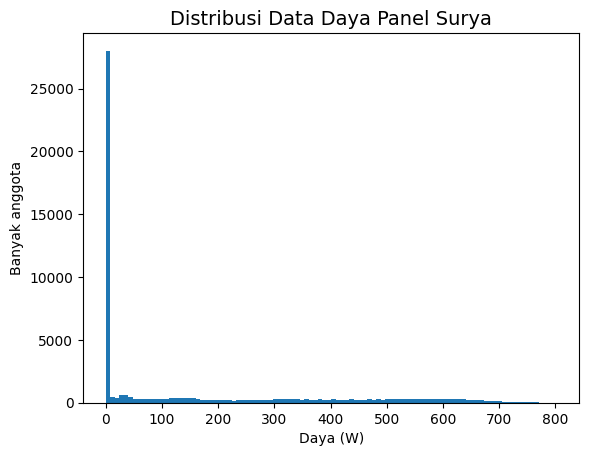
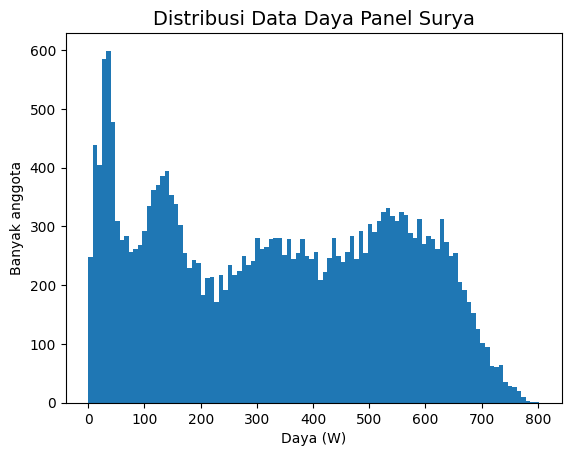
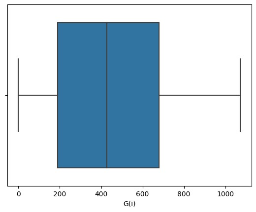
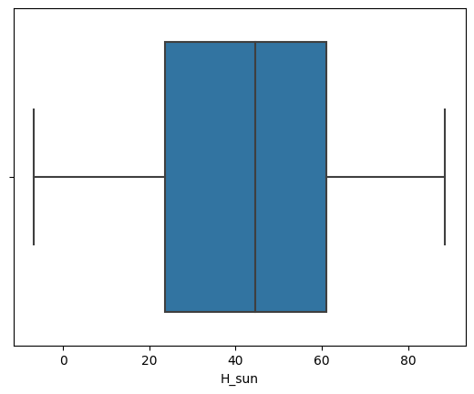
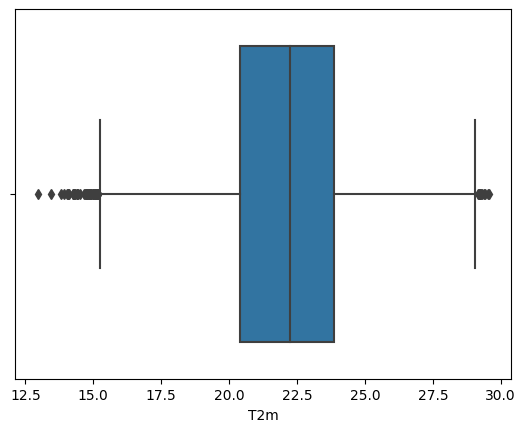
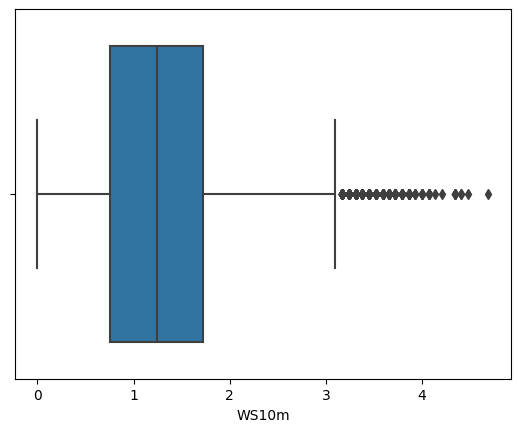
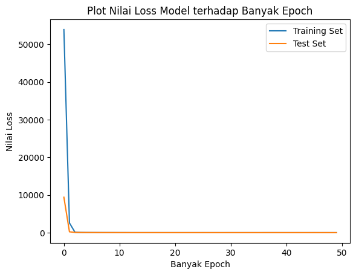
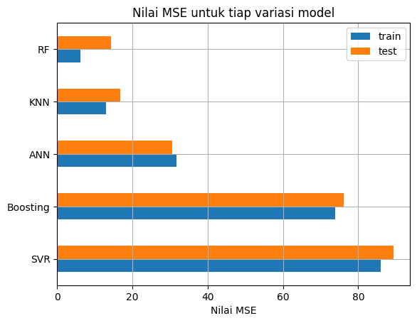

# Laporan Proyek Machine Learning - Aria Wahyu Wicaksono

EN: [README_EN.md](./README_EN.md)
## Domain Proyek

Energi matahari menjadi energi alternatif sebagai sumber listrik yang tidak memiliki emisi[4]. Salah satu cara yang paling banyak digunakan untuk mengkonversi energi matahari menjadi energi listrik adalah dengan menggunakan panel surya. Masalah yang dimiliki panel surya adalah panel surya sangat bergantung terhadap keadaan lingkungan di sekitarnya. Hal ini disebabkan radiasi matahari dapat terhambur akibat adanya awan, sehingga daya yang diterima panel surya menjadi tidak maksimal. Oleh karena itu, untuk menentukan jumlah atau ukuran panel surya yang dibutuhkan untuk kebutuhan rumah atau industri, diperlukan data daya keluaran dari panel surya tahunan[5].

## Business Understanding

### Problem Statements
- Apa saja parameter lingkungan yang berkaitan dengan daya keluaran panel surya?
- Model apa yang dapat memprediksi daya keluaran panel surya berdasarkan parameter-parameter lingkungan yang terkait?

### Goals
- Menentukan parameter lingkungan yang mempengaruhi daya keluaran panel surya
- Menentukan model _machine learning_ yang terbaik untuk memprediksi daya keluaran panel surya berdasarkan parameter lingkungan terkait

### Solution statements
- Nilai korelasi antara tiap parameter terhadap daya keluaran dapat digunakan untuk menentukan parameter lingkungan yang berkaitan dengan daya keluaran panel surya.
- Membandingkan beberapa model _machine learning_ berdasarkan metrik evaluasi, yaitu nilai _mean squared error_ (MSE).

## Data Understanding
Dataset yang digunakan merupakan dataset PVGIS-ERA5 di daerah Bandung dengan koordinat: -6,891°, 107,609° [(sumber)](https://re.jrc.ec.europa.eu/api/v5_2/seriescalc?lat=-6.891&lon=107.609&raddatabase=PVGIS-ERA5&browser=1&outputformat=csv&userhorizon=&usehorizon=1&angle=&aspect=&startyear=2015&endyear=2020&mountingplace=free&optimalinclination=0&optimalangles=1&js=1&select_database_hourly=PVGIS-ERA5&hstartyear=2015&hendyear=2020&trackingtype=0&hourlyoptimalangles=1&pvcalculation=1&pvtechchoice=crystSi&peakpower=1&loss=14). 

Dataset yang digunakan memiliki 52607 data dari tahun 2015 hingga 2020. Terdapat beberapa _null value_ pada dataset yang kemudian di-_drop_, karena jumlah data yang memiliki _null value_ jauh lebih sedikit dibanding jumlah data total. Tabel 1 berikut berisi deskripsi tiap variabel atau parameter.

Tabel 1. Deskripsi Variabel pdada Dataset
| Variabel | Deskripsi |
| --- | --- |
| time | Waktu pengambilan data tiap jam |
| P | Daya terukur pada sistem PV (W) |
| G(i) | _Global irradiance_ ($ \frac{W}{m^2} $)|
| H_sun | Ketinggian matahari (derajat)|
| T2m | Temperatur udara pada ketinggian 2m (derajat Celcius)|
| WS10m | Kecepatan angin total pada ketinggian 10m ($ \frac{m}{s}$) |
| Int | Data biner yang menyatakan nilai pada baris telah direkonstruksi |

Pada proyek kali ini, target yang digunakan adalah `P` ( Daya yang terukur pada sistem PV ). Nampak pad tabel 1 bahwa kolom `Int` hanya merupakan penanda / informasi, sehingga tidak akan digunakan sebagai fitur. Kolom waktu juga tidak digunakan sebagai fitur.

### Analisis Univariat - EDA
Data pada kolom target memiliki distribusi yang condong ke kiri, seperti pada plot histogram di gambar 1. Hal ini disebabkan data dengan nilai daya di antara 0, hingga 8,0213 berjumlah 28019 data. Oleh karena itu, metode _random undersampling_ digunakan untuk meratakan distribusi data.  Metode _random undersampling_ akan mengambil data sejumlah $N$ buah, dengan $N$ lebih kecil dari jumlah data sebelumnya. Akibatnya, data yang tersisa berjumlah 24409 data, seperti pada gambar 2.

Gambar 1. Distribusi daya keluaran (data pada kolom P) sebelum _undersampling_

Gambar 2. Distribusi daya keluaran (data pada kolom P) setelah _undersampling_

### Pembersihan Outlier
| | |
|---|---|
|| |
|| |

Gambar 3. Boxplot untuk masing-masing fitur.

Pada gambar 3, nampak bahwa terdapat _outlier_ pada dataset terutama untuk fitur T2m dan WS10m. Oleh karena itu, metode IQR digunakan untuk menghilangkan _outlier_ pada data untuk tiap nilai parameter. Metode IQR adalah metode yang menghilangkan data yang memiliki nilai 1,5 kali lebih besar dari IQR. IQR sendiri adalah _interquartile range_, atau jarak antara kuartil data pertama dengan kuartil data ketiga.

### Analisis Multivariat - EDA

Tabel 2. Data korelasi antar tiap variabel
|  |  P  |	G(i) |	H_sun |	T2m | WS10m |
| --- | --- | --- | --- | --- | --- |
| P   |	1.000000 |	0.998947 |	0.707226 |	0.394184 |	0.067687 |
| G(i) |	0.998947 |	1.000000 |	0.705327 |	0.410950 |	0.069036 |
| H_sun |	0.707226 |	0.705327 |	1.000000 |	0.618585 |	0.351781 |
| T2m |	0.394184 |	0.410950 |	0.618585 | 1.000000 |	0.527998 |
| WS10m |	0.067687 |	0.069036 |	0.351781 |	0.527998 |	1.000000 |

Nampak pada tabel 2 bahwa hanya fitur `G(i)` dan `H_sun` saja yang berkolerasi kuat terhadap target `P`, dengan nilai korelasi lebih besar dari 0,7. Oleh karena itu, fitur `G(i)` dan `H_sun` akan digunakan sebagai parameter model.

## Data Preparation
- Memisahkan parameter yang akan digunakan sebagai fitur dan target. (`x=df[['G(i)','H_sun']]` dan `y=df['P']`). Tahapan ini diperlukan untuk keperluan proses _training_ maupun evaluasi model

- Membagi dataset menjadi 80% data untuk _training_ dan 20% data untuk _testing_ dan _validation_ dengan menggunakan fungsi `train_test_split` pada modul `sklearn.model_selection`. Tahapan ini diperlukan untuk mendapatkan data _training_ untuk proses pelatihan model dan data _test_ dan _validation_ untuk proses evaluasi model.

- Normalisasi data dengan menggunakan `MinMaxScaler` pada modul `sklearn.preprocessing`. Hal ini bertujuan agar _range_ nilai data berada di rentang 0 hingga 1.

## Modeling
Model yang digunakan adalah model **_artificial neural network_**, **Adaboost**, **_random forest_**, **SVR**, dan **KNN**. Model-model tersebut akan dibandingkan berdasarkan metrik evaluasinya untuk memilih model terbaik. Tiap model diberi `random_state=83`.

### Model 1. Model Artificial Neural Network

_Neural network_ dapat dibagi menjadi dua fase, yaitu fase _feed forward_ dan fase _back propagation_.

Pada fase _feed forward_, _neural network_ bekerja dengan menerima masukan dari tiap _instance training_ data pada _input layer_ dengan jumlah _node_ sesuai dengan jumlah fitur yang digunakan. Kombinasi linear dari tiap _node_ kemudian ditransformasi dengan fungsi aktivasi nonlinear seperti tanh atau ReLU. Keluaran dari fungsi tersebut kemudian dikombinasi linear lagi untuk menghasilkan unit aktivasi pada _layer_ ke-2, dan proses tersebut diulang hingga _layer output_ [1].

Terkadang, _regularizer_ atau penalti ditambahkan pada nilai bobot atau _bias_ di tiap _layer_, dengan tujuan menghindari terjadinya _overfitting_. _Overfitting_ adalah kondisi ketika model tidak dapat menggeneralisasi data, sehingga hasil prediksi data baru menjadi tidak akurat.

Pada fase _back propagation_, model berusaha meminimalisasi fungsi _error_, dalam hal ini nilai MSE, dengan mengatur bobot pada tiap step atau _layer_ [1]. Proses tersebut berlangsung secara iteratif, hingga ke bobot antara _input layer_ dengan _layer_ setelahnya.

Pada proyek kali ini, variasi _hyperparameter_ yang digunakan adalah jumlah _layer_, jumlah _node_, dan penalti/_regularizer_. Arsitektur optimum yang diperoleh adalah 2-8-16-16-16-1, dengan _regularizer_ L2 pada tiap kernel dan _bias_ di tiap _layer_.

### Model 2. Adaboost
_Adaptive boosting_ atau biasa disebut Adaboost merupakan algoritma yang terdiri dari beberapa mesin _regressor_ yang bekerja secara _ensemble_ [3]. _Regressor_ akan melakukan prediksi terhadap data _training_ dan galat prediksi tiap _regressor_ disimpan. Bobot _instance_ tiap _regressor_ di-update terhadap galat prediksi _regressor_ sebelumnya dengan pengali _learning rate_. Hasil akhir prediksi merupakan median berbobot dari tiap _regressor_ [3]. Pada proyek kali ini, jumlah _regressor_ atau _estimator_ dan nilai _learning rate_ divariasikan. Dari percobaan yang dilakukan, jumlah _estimator_ optimum adalah 300 dengan nilai _learning rate_ sebesar 0,8.

### Model 3. Random forest

_Random forest_ adalah kombinasi dari  _decision tree predictor_ terpisah pada waktu pelatihan dan bekerja secara independen [2]. Hasil prediksi untuk regresi diperoleh dengan merata-ratakan hasil prediksi pada _training data_ untuk seluruh _decision tree_ yang dibentuk. Tiap _decision tree_ memiliki kedalaman pohon yang sama. Pada proyek kali ini, kedalaman pohon diuji coba untuk mengetahui kedalaman pohon optimum. Kedalaman pohon optimum yang diperoleh adalah 12 level.

### Model 4. Support Vector Regression (SVR)
_Support vector machine_ bekerja dengan mencari _decision boundary_ sedemikian sehingga margin antara tiap data maksimum [1]. Pada _support vector regression_, algoritma berusaha mencari _hyperplane_ yang fit terhadap data di domain spasialnya. Caranya adalah dengan mencari margin maksimum antara _data point_ dan persamaan regresi terhadap _constraint_ batas galat ($\varepsilon$). Untuk melakukan regresi non-linear, _data point_ ditransformasi ke _feature space_ yang lebih tinggi dengan suatu fungsi kernel. 

Beberapa fungsi kernel yang terdapat pada _library_ scikit-learn adalah fungsi linear, polinomial, dan _radial basis function_ (RBF). Pada proyek kali ini, variasi fungsi kernel diuji coba untuk menentukan model terbaik.Fungsi kernel terbaik berdasarkan percobaan adalah RBF.

### Model 5. K-Nearest Neighbor (KNN)
KNN bekerja dengan membandingkan jarak satu sampel ke sampel pelatihan lain dengan memilih sejumlah k tetangga terdekat. Pada algoritma K-_Nearest Neighbor regressor_, target diprediksi dengan menggunakan titik dari jarak rata-rata dengan k _data point_ terdekat pada dataset [6]. Proses tersebut diulang pada beberapa kemungkinan nilai masukan, sehingga semua prediksi target akan memberikan garis regresi terhadap _data point_.

Pada proyek kali ini, variasi _hyperparameter_ yang di-_tuning_ adalah variasi jumlah tetangga. Jumlah tetangga optimum berdasarkan percobaan adalah sebanyak 8 tetangga.

---

Berdasarkan metrik evaluasi, metode _random forest_ dipilih karena memiliki nilai _loss_ terendah. Akan dibahas pada bab **Evaluation**.

## Evaluation

Metrik evaluasi yang digunakan adalah **_mean squared error_**. _Mean squared error_ menghitung nilai rata-rata kuadrat antara selisih nilai prediksi dengan nilai aktual. _Mean squared error_ dapat digunakan untuk kasus analisis regresi non-linear, sehingga cocok digunakan untuk kasus prediksi pada proyek ini. Berikut adalah formula dari _Mean squared error_:

$$MSE = \frac{1}{n}\sum_{i=1}^{n}(y_i - \hat{y_i})^2$$

dimana:
- n adalah banyak data observasi,
- $y_i$ adalah nilai aktual target untuk observasi data ke-$i$,
- $\hat{y_i}$ adalah nilai prediksi target untuk observasi data ke-$i$.

Gambar 4. Plot nilai _loss_ pada model ANN

Nampak pada gambar 4 bahwa nilai _loss_ untuk data _training_ dan _test_ konvergen ke nol. Model ANN juga tidak mengalami _overfit_ atau _underfit_, ditandai dengan nilai _loss_ untuk data _training_ maupun data _test_ yang tidak berbeda jauh seperti yang ditunjukkan pada tabel 3.

Tabel 3. Nilai MSE data _train_ dan _test_ pada tiap model.

| | train |	test |
| --- | --- | --- |
|ANN |	31.730236 |	30.512764 |
|Boosting |	73.943445 |	76.065942 |
|RF |	6.154884 |	14.350952 |
|SVR |	86.019075 |	89.360662 |
|KNN |	12.976992 |	16.773169 |

Tabel 4. Hasil prediksi tiap model untuk 5 sampel data _test_.
| | y_true |	prediksi_ANN |	prediksi_Boosting |	prediksi_RF |prediksi_SVR	| prediksi_KNN |
| --- | --- | --- | --- | --- | --- | --- |
|0|	234.15 |	224.96 |	219.94 |	205.87 |	224.74 |	207.64 |
|1|	399.15 |	397.14 |	410.33 |	396.46 |	397.59 |	400.06 |
|2|	114.60 |	117.65 |	117.97 |	113.25 |	115.27 |	113.36 |
|3|	533.25 |	533.35 |	536.60 |	533.73 |	533.72 |	533.92 |
|4|	159.42 |	157.60 |	147.50 |	159.55 |	161.23 |	159.25 |

Nampak pada tabel 3 ataupun gambar 5 bahwa model _random forest_ merupakan model yang memiliki nilai _loss_ MSE terendah, sehingga dapat memberikan nilai prediksi terakurat, seperti pada tabel 4.

Gambar 5. Nilai MSE untuk tiap model

## Kesimpulan 

- Parameter lingkungan yang mempengaruhi daya keluaran panel surya berdasarkan nilai korelasinya adalah _global irradiance_ (G(i)) dan ketinggian matahari (H_sun).
- Model _machine learning_ yang terbaik untuk memprediksi daya keluaran panel surya berdasarkan parameter lingkungan terkait adalah model _random forest_, dengan nilai _loss_ MSE sebesar 6,142684 untuk data _train_ dan 14,706933 untuk data _test_.

## Referensi:

[1] Bishop, Christopher M. 2006. Pattern Recognition and Machine Learning. New York :Springer.

[2] Breiman, L. 2001. Random Forests. Machine Learning 45, 5–32. DOI:10.1023/A:1010933404324

[3] Drucker, Harris. 1997. Improving Regressors Using Boosting Techniques. Proceedings of the 14th International Conference on Machine Learning. 

[4] Loic Queval. 2023. Estimation of the electricity production of a PV installation using PVGIS. Engineering school. France:CentraleSupélec.

[5] Psomopoulos, C.S., Ioannidis, G.C., Kaminaris, S.D. et al. 2015. A Comparative Evaluation of Photovoltaic Electricity Production Assessment Software (PVGIS, PVWatts and RETScreen). Environ. Process. 2 (Suppl 1), 175–189. 

[6] Speegle, Darrin. 2020. Applied Regression with R. Saint Louis University.
