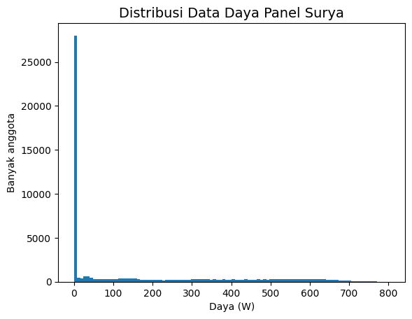
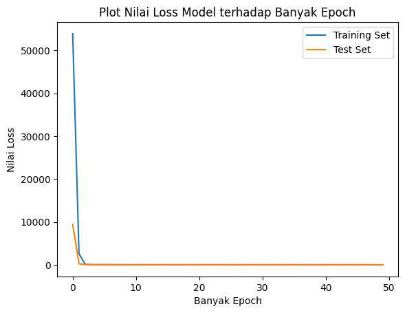
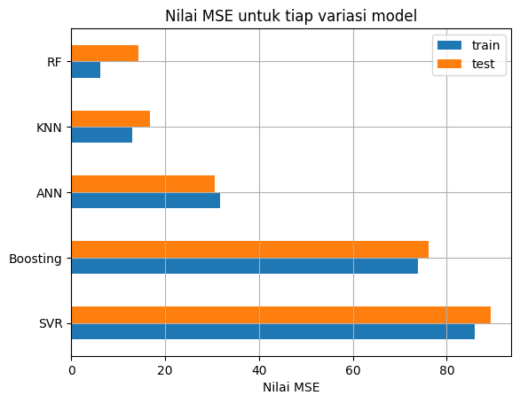

# Machine Learning Project Report - Aria Wahyu Wicaksono

## Project Domains

Solar energy is an alternative energy as a source of electricity that has no emissions [4]. One of the most widely used ways to convert solar energy into electrical energy is to use solar panels. The problem with solar panels is that they are very dependent on the surrounding environment. This is because solar radiation can be scattered due to clouds, so that the power received by solar panels is not optimal. Therefore, to determine the number or size of solar panels needed for home or industrial needs, annual output power data from solar panels is needed [5].

## Business Understanding

### Problem Statements
- What are the environmental parameters related to the output power of solar panels?
- What model can predict the output power of solar panels based on related environmental parameters?

### Goals
- Determine the environmental parameters that affect the output power of solar panels
- Determine the best _machine learning_ model to predict the output power of solar panels based on related environmental parameters

### Solution statements
- Correlation value between each parameter to output power can be used to determine environmental parameters related to solar panel output power.
- Comparing several _machine learning_ models based on evaluation metrics, namely _mean squared error_ (MSE) values.

## Data Understanding
The dataset used is the PVGIS-ERA5 dataset in the Bandung area with coordinates: -6,891°, 107,609° [(source)](https://re.jrc.ec.europa.eu/api/v5_2/seriescalc?lat=-6.891&lon=107.609&raddatabase=PVGIS-ERA5&browser=1&outputformat=csv&userhorizon=&usehorizon=1&angle=&aspect=&startyear=2015&endyear=2020&mountingplace=free&optimalinclination=0&optimalangles=1&js=1&select_database_hourly=PVGIS-ERA5&hstartyear=2015&hendyear=2020&trackingtype=0&hourlyoptimalangles=1&pvcalculation=1&pvtechchoice=crystSi&peakpower=1&loss=14). 

The dataset used has 52607 data from 2015 to 2020. There are several null values in the dataset which are then dropped, because the amount of data that has a null value is far less than the total amount of data. Table 1 below contains a description of each variable or parameter.

Table 1. Description of the Variables in the Dataset

| Variable | Description |
| --- | --- |
| time | Hourly data collection time |
| P | Rated power on PV systems (W) |
| G(i) | _Global irradiance_ ($\frac{W}{m^2}$)|
| H_sun | Altitude of the sun (degrees)|
| T2m | Air temperature at an altitude of 2m (degrees Celsius)|
| WS10m | Total wind speed at 10m ($\frac{m}{s}$) |
| Int | Reconstructed binary data representing row values |

In this project, the target used is `P` (Measured power on the PV system). It can be seen in table 1 that the `Int` column is only a marker/information, so it will not be used as a feature. The time column is also not used as a feature.

### Univariate Analysis - EDA
The data in the target column has a distribution that is skewed to the left, as in the histogram plot in Figure 1. This is due to data with power values between 0 to 8.0213 totaling 28019 data. Therefore, the _random undersampling_ method is used to even out the distribution of the data. The _random undersampling_ method will retrieve $N$ of data, with $N$ smaller than the previous amount of data. As a result, the remaining data is 24409 data, as shown in Figure 2.

Figure 1. Output power distribution (data in column P) before _undersampling_

Figure 2. Output power distribution (data in column P) after _undersampling_

### Outlier Cleanup
| | |
|---|---|
|| |
|| |

Figure 3. Boxplot for each feature.

In Figure 3, it appears that there are _outliers_ in the dataset, especially for the T2m and WS10m features. Therefore, the IQR method is used to eliminate _outliers_ in the data for each parameter value. The IQR method is a method that eliminates data that has a value 1.5 times greater than IQR. IQR itself is the interquartile range, or the distance between the first data quartile and the third data quartile.

### Multivariate Analysis - EDA

Table 2. Correlation data between each variable
| | P | G(i) | H_sun | T2m | WS10m |
| --- | --- | --- | --- | --- | --- |
| P | 1.000000 | 0.998947 | 0.707226 | 0.394184 | 0.067687 |
| G(i) | 0.998947 | 1.000000 | 0.705327 | 0.410950 | 0.069036 |
| H_sun | 0.707226 | 0.705327 | 1.000000 | 0.618585 | 0.351781 |
| T2m | 0.394184 | 0.410950 | 0.618585 | 1.000000 | 0.527998 |
| WS10m | 0.067687 | 0.069036 | 0.351781 | 0.527998 | 1.000000 |

It can be seen in table 2 that only the `G(i)` and `H_sun` features have a strong correlation with the target `P`, with a correlation value greater than 0.7. Therefore, the `G(i)` and `H_sun` features will be used as model parameters.

## Data Preparation
- Separating parameters to be used as features and targets. (`x=df[['G(i)','H_sun']]` and `y=df['P']`). This stage is necessary for the purposes of the _training_ process and model evaluation

- Split the dataset into 80% data for _training_ and 20% data for _testing_ and _validation_ by using the `train_test_split` function in the `sklearn.model_selection` module. This stage is needed to obtain _training_ data for the model training process and _test_ and _validation_ data for the model evaluation process.

- Data normalization using `MinMaxScaler` in `sklearn.preprocessing` module. This is so that the _range_ data values are in the range 0 to 1.

## Modeling
The models used are the **_artificial neural network_**, **Adaboost**, **_random forest_**, **SVR**, and **KNN** models. These models will be compared based on their evaluation metrics to select the best model. Each model is assigned `random_state=83`.

### Model 1. Artificial Neural Network Model

_Neural network_ can be divided into two phases, namely the feed forward phase and the back propagation phase.

In the _feed forward_ phase, _neural network_ works by receiving input from each _instance training_ data on the _input layer_ with the number of _nodes_ according to the number of features used. The linear combination of each _node_ is then transformed with a nonlinear activation function such as tanh or ReLU. The outputs of these functions are then combined linearly again to produce activation units on the 2nd _layer_, and the process is repeated until _layer output_ [1].

Sometimes, a _regularizer_ or penalty is added to the value of the weight or _bias_ in each _layer_, with the aim of avoiding _overfitting_. _Overfitting_ is a condition when the model is unable to generalize the data, so the prediction results of new data are inaccurate.

In the _back propagation_ phase, the model tries to minimize the _error_ function, in this case the MSE value, by adjusting the weights at each step or _layer_ [1]. The process takes place iteratively, up to the weight between the _input layer_ and the _layer_ after.

In this project, variations of the hyperparameter used are the number of layers, the number of nodes, and the penalty/regularizer. The optimal architecture obtained is 2-8-16-16-16-1, with _regularizer_ L2 in each kernel and _bias_ in each _layer_.

### Model 2. Adaboost
_Adaptive boosting_ or commonly called Adaboost is an algorithm consisting of several _regressor_ engines that work in _ensemble_ [3]. _Regressor_ will make predictions on _training_ data and prediction errors for each _regressor_ stored. The _instance_ weight of each _regressor_ is updated against the previous _regressor_ prediction error by the _learning rate_ multiplier. The final prediction result is the weighted median of each regressor [3]. In this project, the number of _regressors_ or _estimators_ and the value of _learning rate_ are varied. From the experiments conducted, the optimum number of estimators is 300 with a learning rate of 0.8.

### Model 3. Random forest

_Random forest_ is a combination of _decision tree predictors_ separated at the time of training and working independently [2]. The prediction results for the regression are obtained by averaging the prediction results on the training data for all decision trees formed. Each _decision tree_ has the same tree depth. In this project, tree depth was tested to determine the optimum tree depth. The optimum tree depth obtained is 12 levels.

### Model 4. Support Vector Regression (SVR)
_Support vector machine_ works by finding _decision boundary_ such that the margin between each data is maximum [1]. In support vector regression, the algorithm tries to find a hyperplane that fits the data in its spatial domain. The trick is to find the maximum margin between _data point_ and the regression equation against the _constraint_ error limit ($\varepsilon$). To perform non-linear regression, _data point_ is transformed to a higher _feature space_ by a kernel function.

Some of the kernel functions contained in the scikit-learn library are linear, polynomial, and radial basis functions (RBF). In this project, various kernel functions were tested to determine the best model. The best kernel function based on the experiment was RBF.

### Model 5. K-Nearest Neighbor (KNN)
KNN works by comparing the distance of one sample to another training sample by selecting a number of k nearest neighbors. In the K-Nearest Neighbor regressor algorithm, the target is predicted using a point from the average distance to the closest k data point in the dataset [6]. The process is repeated for several possible input values, so that all target predictions will provide a regression line against _data point_.

In this project, the variation of the _hyperparameter_ that is being _tuned_ is the variation in the number of neighbors. The optimum number of neighbors based on the experiment is 8 neighbors.

---

Based on evaluation metrics, the _random forest_ method was chosen because it has the lowest _loss_ value. Will be discussed in the **Evaluation** chapter.

## Evaluation

The evaluation metric used is **_mean squared error_**. _Mean squared error_ calculates the average squared value between the difference between the predicted value and the actual value. _Mean squared error_ can be used for non-linear regression analysis cases, so it is suitable for prediction cases in this project. Here is the formula for _Mean squared error_:

$$MSE = \frac{1}{n}\sum_{i=1}^{n}(y_i - \hat{y_i})^2$$

Where:
- n is the number of observation data,
- $y_i$ is the target actual value for the $i$ data observation,
- $\hat{y_i}$ is the target prediction value for the $i$ data observation.

Figure 4. Plot of _loss_ values in the ANN model

It can be seen in Figure 4 that the _loss_ values for _training_ and _test_ data converge to zero. The ANN model also does not experience _overfit_ or _underfit_, marked by _loss_ values for _training_ data and _test_ data which do not differ much as shown in table 3.

Table 3. MSE values of _train_ and _test_ data for each model.

| | train | tests |
| --- | --- | --- |
|ANN | 31.730236 | 30.512764 |
|Boosting | 73.943445 | 76.065942 |
|RF | 6.154884 | 14.350952 |
|SVR | 86.019075 | 89.360662 |
|KNN | 12.976992 | 16.773169 |

Table 4. Prediction results for each model for 5 sample _test_ data.
| | y_true | prediction_ANN | prediction_Boosting | prediction_RF | prediction_SVR | prediction_KNN |
| --- | --- | --- | --- | --- | --- | --- |
|0| 234.15 | 224.96 | 219.94 | 205.87 | 224.74 | 207.64 |
|1| 399.15 | 397.14 | 410.33 | 396.46 | 397.59 | 400.06 |
|2| 114.60 | 117.65 | 117.97 | 113.25 | 115.27 | 113.36 |
|3| 533.25 | 533.35 | 536.60 | 533.73 | 533.72 | 533.92 |
|4| 159.42 | 157.60 | 147.50 | 159.55 | 161.23 | 159.25 |

It can be seen in table 3 or figure 5 that the random forest model is the model that has the lowest MSE loss value, so it can provide the most accurate predictive value, as shown in table 4.

Figure 5. MSE values for each model

## Conclusion

- Environmental parameters that affect the output power of solar panels based on the correlation value are _global irradiance_ (G(i)) and sun altitude (H_sun).
- The best _machine learning_ model for predicting solar panel output power based on related environmental parameters is the _random forest_ model, with a _loss_ MSE value of 6.142684 for _train_ data and 14.706933 for _test_ data.

## Reference:

[1] Bishop, Christopher M. 2006. Pattern Recognition and Machine Learning. New York : Springers.

[2] Breiman, L. 2001. Random Forests. Machine Learning 45, 5–32. DOI:10.1023/A:1010933404324

[3] Drucker, Harris. 1997. Improving Regressors Using Boosting Techniques. Proceedings of the 14th International Conference on Machine Learning.

[4] Loic Queval. 2023. Estimation of the electricity production of a PV installation using PVGIS. Engineering school. France:CentraleSupélec.

[5] Psomopoulos, CS, Ioannidis, GC, Kaminaris, SD et al. 2015. A Comparative Evaluation of Photovoltaic Electricity Production Assessment Software (PVGIS, PVWatts and RETScreen). environment. Process. 2 (Suppl 1), 175–189.

[6] Speegle, Darrin. 2020. Applied Regression with R. Saint Louis University.

